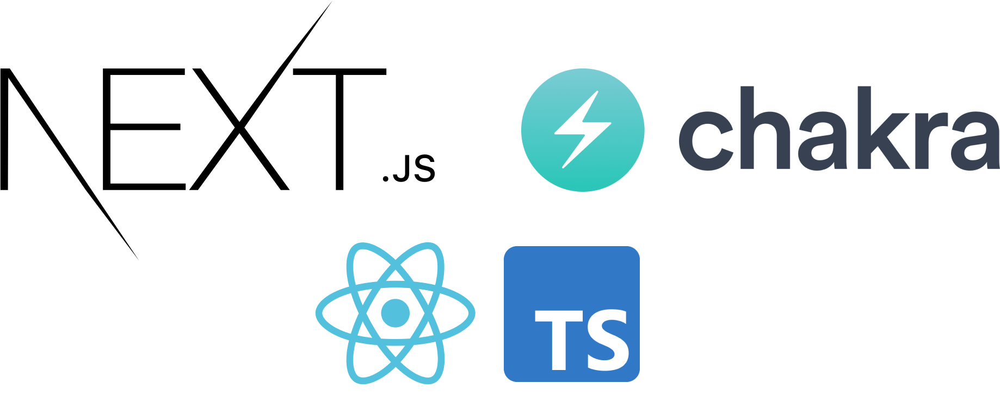
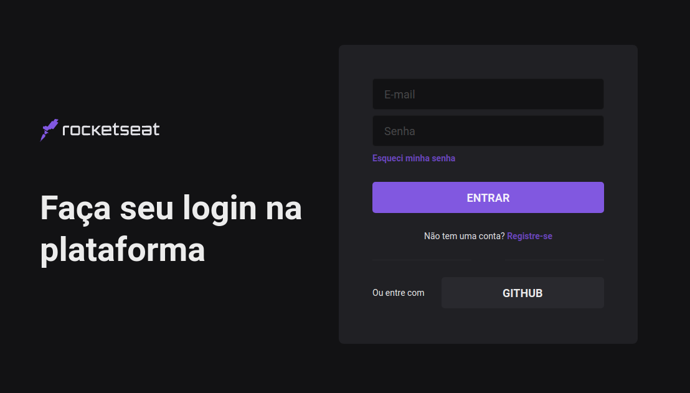

<br>
<div align="center">
  

  <h4 align="center">
    Aplicação construída com NextJS e ChakraUI para aprendizado de como funciona uma aplicação seguindo um Design System. Acesse o tutorial <a href="https://www.youtube.com/watch?v=6TEo2AxW-oQ">aqui</a>
  </h4>
</div>

---

<p align="center">
  

</p>

<p align="center">
  
</p>


## 🚀 Instalação e execução
Para clonar e executar a aplicação, você precisará ter instalado em sua máquina o [Git](https://git-scm.com), [Node.js](https://nodejs.org) + [Yarn](https://yarnpkg.com). Com todos os programas instalados, execute as seguintes linhas de comando:

```bash
# Clone esse repositório
$ git clone https://github.com/eugustavo/nextjs-chakraui

# Acesse o repositório
$ cd nextjs-chakraui

# Instale as dependências
$ yarn install

# Inicie a aplicação
$ yarn dev
```

---
Feito com ♥ por Gustavo Souza :wave: [Contato](https://www.linkedin.com/in/eugustavosouza/)


